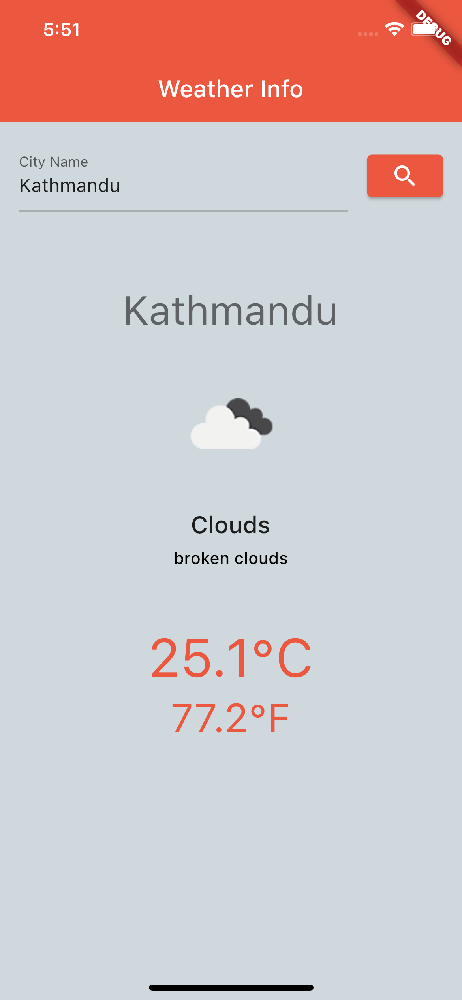
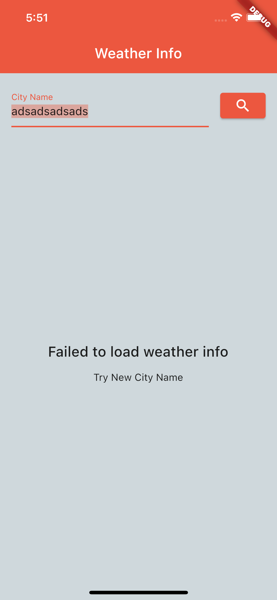

# Weather Info


---
Weather Info is a simple Flutter Application which retrieves weather information from [Open Weather Map](https://openweathermap.org/api). The Project uses MVVM pattern created using [stacked](https://pub.dev/packages/stacked) package with using [Provider](https://pub.dev/packages/provider) as State Management option.

#### List of Dependencies Used:
1. [Stacked](https://pub.dev/packages/stacked)
2. [Http](https://pub.dev/packages/http)
3. [GetIt](https://pub.dev/packages/get_it)
4. [Stacked Services](https://pub.dev/packages/stacked_services) <- Optional as Stacked Package had dependency when generating code.
5. [JSON Annotation](https://pub.dev/packages/json_annotation) <- Annotation Required for JSON Serializable

#### Dev Dependencies:
1. [Build Runner](https://pub.dev/packages/build_runner) <- Required for Code Generation
2. [Stacked Generator](https://pub.dev/packages/stacked_generator) <- Code Generator for Stacked Package
3. [Mockito](https://pub.dev/packages/mockito) <- For Testing With Mocks
4. [Flutter Launcher Icons](https://pub.dev/packages/flutter_launcher_icons) <- For Launcher Icons
5. [JSON Serializable](https://pub.dev/packages/json_serializable) <- Code generation for Model Class from JSON Response

For this task I used the following link to get the weather depending on `cityName`. 

```bash
https://api.openweathermap.org/data/2.5/weather?q={cityName}&appid={apiKey}
```

To use this api endpoint you need to add an apiKey that you can get from the link [My API KEY](https://home.openweathermap.org/api_keys) for which you need to register which is free.

Sample Response from the API is something like this:
```json
{
  "coord": {
    "lon": -0.1257,
    "lat": 51.5085
  },
  "weather": [
    {
      "id": 803,
      "main": "Clouds",
      "description": "broken clouds",
      "icon": "04d"
    }
  ],
  "base": "stations",
  "main": {
    "temp": 294.53,
    "feels_like": 294.63,
    "temp_min": 292.59,
    "temp_max": 296.43,
    "pressure": 1015,
    "humidity": 73
  },
  "visibility": 10000,
  "wind": {
    "speed": 4.63,
    "deg": 230
  },
  "clouds": {
    "all": 75
  },
  "dt": 1658304575,
  "sys": {
    "type": 2,
    "id": 2075535,
    "country": "GB",
    "sunrise": 1658290010,
    "sunset": 1658347589
  },
  "timezone": 3600,
  "id": 2643743,
  "name": "London",
  "cod": 200
}
```

***YOU NEED FLUTTER INSTALLED IN YOUR SYSTEM***

***THE PROJECT IS CREATED IN FLUTTER VERSION 3.0.4***

## To run the project

### Steps
1. Unzip the folder to get weather_info folder.
2. `cd weather_info` to change directory to weather_info
3. `flutter pub get` to install all the dependencies

### ***THE PROJECT DOESNOT CONTAIN API KEY***
replace `YOUR_API_KEY` with ApiKey inside lib/core/constants.dart file the you can run the app

## To Build and Run the Application
1. Connect your device Android / IOS
2. For Android only Enable Debugging Mode
3. `flutter run --release` to run the app in release mode.


***For Ease an APK file has been added along with the Project File as well named weather_info.apk.***

Sample Snapshot of the Process:

|After Searching using valid City Name|After Searching using invalid City Name|
|-|-|
|||

## Regarding Test Info
The Project Consists of some testcases written for just viewModel. To run the Test Case + Coverage
```flutter test --coverage```, This will generate a folder coverage with lcov.Info file which consists of coverage report. Finally This project is small and currently has the Test Coverage of 100%. ***Note: Only Unit Test is covered.***
